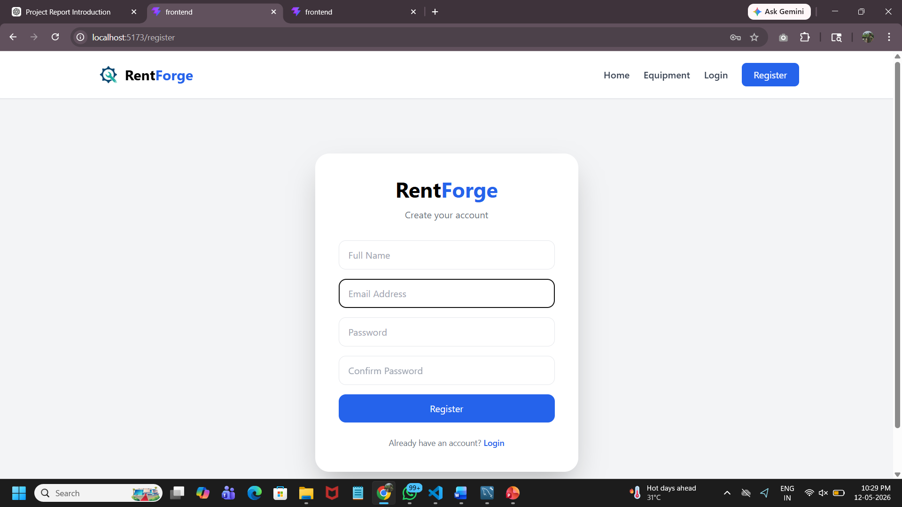
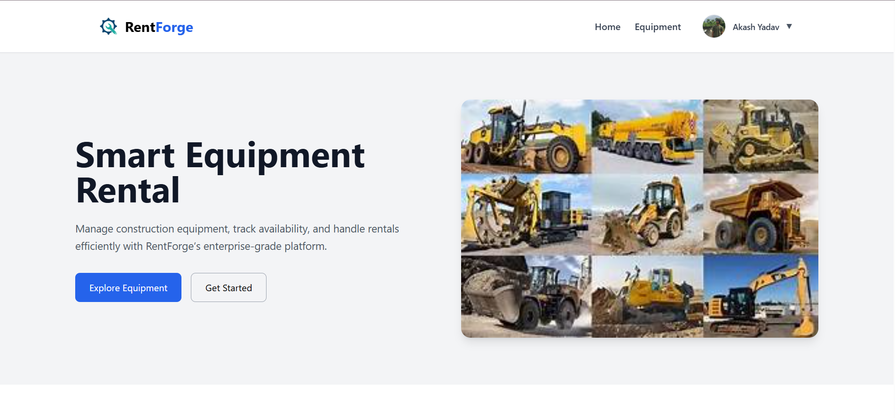
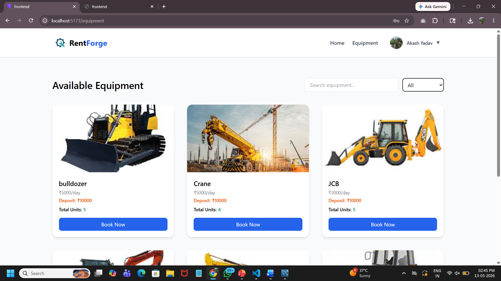
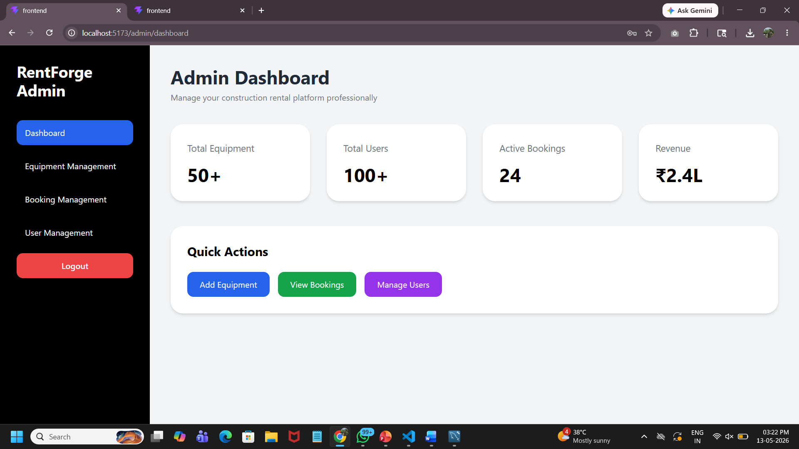
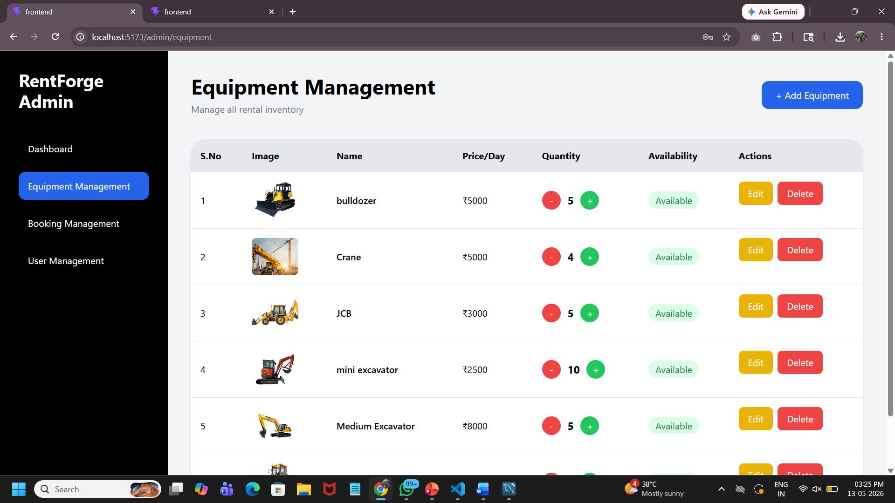
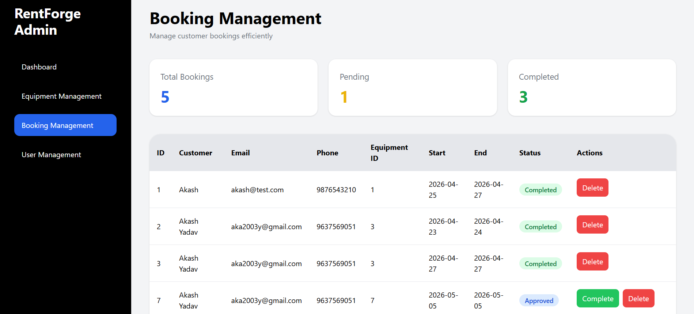

# RentForge

## Construction Equipment Rental Management System

RentForge is a full-stack web application designed to simplify the process of renting construction equipment. The platform allows customers to browse equipment, check availability, make bookings, and manage rentals, while administrators can manage inventory, users, and bookings through a dedicated dashboard.

---

# Features

## User Features

* User Registration & Login
* Google Authentication using Firebase
* Browse Available Equipment
* Search and Filter Equipment
* Date-wise Equipment Booking
* Multi-Unit Equipment Booking
* Security Deposit Calculation
* Online Payment (Razorpay)
* Cash Payment Option
* Booking History Management
* Profile Management

## Admin Features

* Admin Dashboard
* Equipment Management
* Add Equipment
* Edit Equipment
* Delete Equipment
* Inventory Quantity Management
* Booking Approval & Completion
* User Management
* Booking Monitoring
* Availability Tracking

## Smart Booking Features

* Date-based Availability Checking
* Multi-Quantity Equipment Support
* Overlapping Booking Validation
* Automatic Stock Management
* Security Deposit Tracking

---

# Tech Stack

## Frontend

* React.js
* Tailwind CSS
* Axios
* React Router DOM

## Backend

* Spring Boot
* Spring Data JPA
* Hibernate

## Database

* MySQL

## Authentication

* Firebase Authentication
* Google Sign-In

## Payment Gateway

* Razorpay

## Version Control

* Git
* GitHub

---

# Project Structure

```text
RentForge
│
├── frontend
│   ├── src
│   │   ├── pages
│   │   ├── components
│   │   ├── context
│   │   └── services
│   │
│   └── public
│
├── backend
│   ├── src/main/java/com/rentforge/backend
│   │   ├── controller
│   │   ├── entity
│   │   ├── repository
│   │   └── service
│   │
│   └── src/main/resources
│       └── application.properties
│
└── README.md
```

---

# Database Connectivity

The backend uses Spring Boot with Hibernate JPA for database connectivity.

## Configuration File

```text
RentForge/backend/src/main/resources/application.properties
```

## Entity Layer

```text
RentForge/backend/src/main/java/com/rentforge/backend/entity
```

## Repository Layer

```text
RentForge/backend/src/main/java/com/rentforge/backend/repository
```

## Controller Layer

```text
RentForge/backend/src/main/java/com/rentforge/backend/controller
```

---

# Installation and Setup

## Clone Repository

```bash
git clone https://github.com/akash2003y/RentForge.git
```

## Backend Setup

```bash
cd backend
```

Configure MySQL credentials in:

```properties
application.properties
```

Run Backend:

```bash
./mvnw spring-boot:run
```

## Frontend Setup

```bash
cd frontend
npm install
npm run dev
```

---

# Screenshots

## Login Page

```md

```

## Home Page

```md

```

## Equipment Listing

```md

```

## Admin Dashboard

```md

```

## Equipment Management

```md

```

## Booking Management

```md


```

---

# Future Enhancements

* Equipment Return Management
* Damage Inspection System
* Deposit Refund System
* Invoice Generation
* Email Notifications
* SMS Alerts
* Advanced Analytics Dashboard
* Equipment Maintenance Tracking

---

# Author

**Akash Yadav**

Master of Computer Applications (MCA)

D. Y. Patil Institute of Master of Computer Applications and Management, Pune

---

# License

This project is developed for educational and academic purposes.
